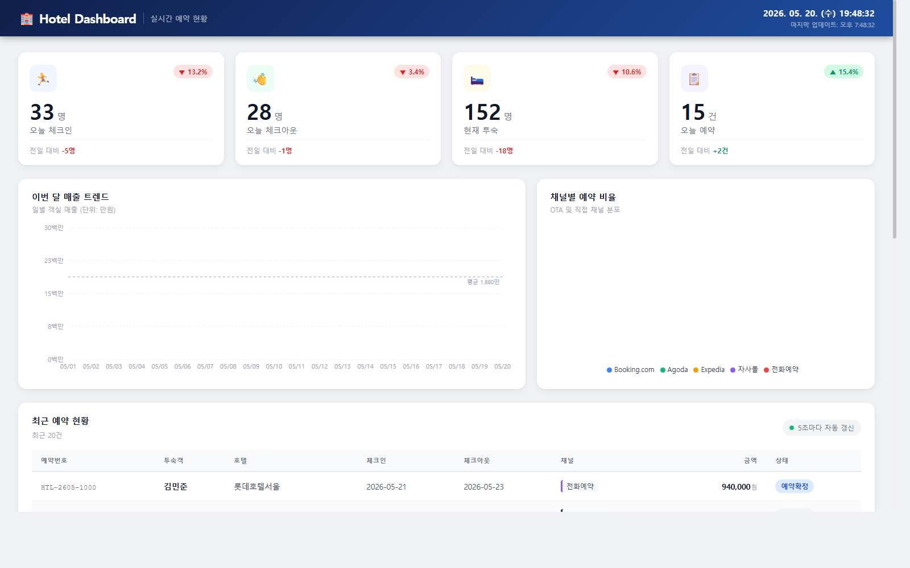

# 🏨 Hotel Dashboard — 호텔 예약 현황 실시간 대시보드

[](https://openjdk.org/)
[](https://spring.io/projects/spring-boot)
[](https://reactjs.org/)
[](https://recharts.org/)
[](https://axios-http.com/)
[](https://claude.ai/code)

서울 5성급 호텔 5곳의 실시간 예약 현황을 한눈에 볼 수 있는 대시보드입니다.  
KPI 카드, 매출 트렌드 차트, 채널별 비율, 예약 목록을 5초마다 자동 갱신합니다.

---

## 실제 화면



---

## 화면 구성

대시보드는 **헤더 + 4개 구역**으로 이루어져 있습니다.

### 헤더
짙은 네이비 그라디언트 상단 바. 좌측에 `🏨 Hotel Dashboard` 로고와 `실시간 예약 현황` 부제목, 우측에 초 단위로 갱신되는 현재 시각과 마지막 데이터 업데이트 시각을 표시합니다. 스크롤해도 화면 상단에 고정됩니다.

### 1. KPI 카드 (상단 4개)

| 카드 | 측정 지표 | 색상 |
|------|-----------|------|
| 오늘 체크인 | 당일 체크인 인원 수 | 파랑 |
| 오늘 체크아웃 | 당일 체크아웃 인원 수 | 초록 |
| 현재 투숙 | 현재 투숙 중인 총 인원 수 | 주황 |
| 오늘 예약 | 당일 신규 예약 건수 | 보라 |

각 카드는 **아이콘 + 전일 대비 증감 배지(▲/▼ %) + 숫자 + 전일 대비 절댓값**을 한 번에 보여줍니다. 증가는 초록, 감소는 빨강으로 색상 구분되며, 카드 위에 마우스를 올리면 살짝 떠오르는 hover 효과가 있습니다.

### 2. 이번 달 매출 트렌드 (좌측 차트)

이번 달 1일부터 오늘까지의 **일별 객실 매출** 면적 그래프입니다.

- Y축: 백만 원 단위 (`8백만`, `15백만`, `23백만`, `30백만`)
- X축: 날짜 (`05/01` ~ `05/20`)
- 파란 곡선 + 아래로 페이드아웃되는 그라디언트 채움
- 점선으로 **월 평균 매출 기준선** 표시 (`평균 1,880만` 등)
- 데이터 포인트에 마우스를 올리면 날짜·만원 단위·원 단위 툴팁이 함께 표시

### 3. 채널별 예약 비율 (우측 차트)

OTA 및 직접 채널의 **예약 점유율 도넛 차트**입니다.

| 채널 | 색상 |
|------|------|
| Booking.com | 파랑 (25.3%) |
| Agoda | 초록 (21.1%) |
| Expedia | 주황 (16.8%) |
| 자사몰 | 보라 (20.0%) |
| 전화예약 | 빨강 (16.8%) |

비율이 8% 미만인 슬라이스는 레이블을 숨겨 겹침을 방지합니다. 슬라이스에 마우스를 올리면 해당 채널만 강조(나머지 흐리게)되고, 예약 건수와 비율이 툴팁으로 표시됩니다.

### 4. 최근 예약 현황 (하단 테이블)

가장 최근 예약 20건을 테이블로 표시합니다. 우측 상단에 초록 점이 깜빡이며 **5초마다 자동 갱신** 중임을 알립니다.

| 컬럼 | 내용 |
|------|------|
| 예약번호 | `HTL-2605-1000` 형식 고정폭 폰트 |
| 투숙객 | 이름 굵게 표시 |
| 호텔 | 롯데호텔서울·그랜드하얏트서울·조선팰리스·파르나스호텔·시그니엘서울 |
| 체크인/체크아웃 | `YYYY-MM-DD` 형식 |
| 채널 | 채널별 고유 색상의 좌측 보더 태그 |
| 금액 | 천 단위 콤마 포맷 (`940,000원`) |
| 상태 | 컬러 뱃지 — 예약확정(파랑) / 체크인(초록) / 체크아웃(회색) / 취소(빨강) |

행에 마우스를 올리면 파란 하이라이트로 강조됩니다.

---

## Features

| 기능 | 설명 |
|------|------|
| **KPI 카드 4종** | 오늘 체크인·체크아웃·현재 투숙·오늘 예약 + 전일 대비 증감 |
| **매출 트렌드** | 이번 달 1일~오늘까지 일별 매출 면적 그래프 (Recharts AreaChart) |
| **채널 비율** | Booking.com / Agoda / Expedia / 자사몰 / 전화예약 도넛 차트 |
| **예약 목록** | 최근 20건 테이블, 상태별 컬러 뱃지, 5초 자동 갱신 |
| **반응형** | 모바일 / 태블릿 / 데스크톱 대응 |
| **실시간 시계** | 헤더에 초 단위 현재 시각 표시 |

---

## Tech Stack

### Backend
- **Java 17** + **Spring Boot 3.2** + **Gradle**
- REST API 4개 (`/api/dashboard/*`)
- MockDataGenerator — 서울 5성급 호텔 5곳 기반 목 데이터 (롯데호텔서울, 그랜드하얏트서울, 조선팰리스, 파르나스호텔, 시그니엘서울)
- CORS 허용 (`localhost:3000`)

### Frontend
- **React 18** (Create React App)
- **Recharts 2.x** — AreaChart, PieChart
- **Axios 1.x** — API 호출
- CSS Modules (컴포넌트 단위 스타일링)

---

## 실행 방법

### 1. Backend 실행 (포트 8080)

```bash
cd hotel-dashboard/backend
```

**gradlew.bat 사용 (Windows — Gradle wrapper 포함됨):**
```bash
gradlew.bat bootRun
```

**직접 실행 (gradle-wrapper.jar 방식):**
```bash
java -classpath "gradle/wrapper/gradle-wrapper.jar" org.gradle.wrapper.GradleWrapperMain bootRun
```

> 최초 실행 시 Gradle 8.5 (~100MB) 자동 다운로드됩니다 (약 30초~1분 소요).

> **Java 요구사항:** Java 11 이상 (현재 Spring Boot 2.7.18 기준)

> 서버 시작 확인: `http://localhost:8080/api/dashboard/today-status`

### 2. Frontend 실행 (포트 3000)

```bash
cd hotel-dashboard/frontend
npm install
npm start
```

> 브라우저에서 `http://localhost:3000` 접속

> **주의:** Backend가 먼저 실행된 상태여야 데이터가 표시됩니다.

---

## API Endpoints

| Method | Endpoint | 응답 |
|--------|----------|------|
| `GET` | `/api/dashboard/today-status` | 오늘 체크인/체크아웃/투숙/예약 수 + 전일 비교값 |
| `GET` | `/api/dashboard/channel-share` | 채널별 예약 건수 및 비율 |
| `GET` | `/api/dashboard/monthly-revenue` | 이번 달 일별 매출 (KRW) |
| `GET` | `/api/dashboard/reservations` | 최근 예약 20건 (예약번호·투숙객·호텔·채널·금액·상태) |

---

## Project Structure

```
hotel-dashboard/
├── backend/
│   ├── build.gradle
│   ├── settings.gradle
│   └── src/main/java/com/hotel/dashboard/
│       ├── HotelDashboardApplication.java
│       ├── config/WebConfig.java            ← CORS 설정
│       ├── controller/DashboardController.java
│       ├── service/DashboardService.java
│       ├── dto/
│       │   ├── TodayStatusDto.java
│       │   ├── ChannelShareDto.java
│       │   ├── MonthlyRevenueDto.java
│       │   └── ReservationDto.java
│       └── mock/MockDataGenerator.java      ← 목 데이터 생성
└── frontend/
    ├── package.json
    └── src/
        ├── App.jsx / App.css
        ├── index.js / index.css
        ├── api/dashboardApi.js
        └── components/
            ├── StatCard.jsx / StatCard.css
            ├── LineChart.jsx
            ├── PieChart.jsx
            └── ReservationTable.jsx / ReservationTable.css
```

---

*Built with [Claude Code](https://claude.ai/code)*
